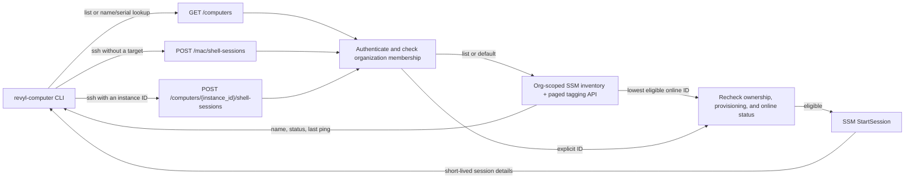

# Revyl Computer

`revyl-computer` is a separate CLI for discovering and accessing your
organization's assigned computers. The mobile testing CLI remains `revyl`;
list computers with `revyl-computer list` and open a shell with
`revyl-computer ssh`.

## Install

### macOS and Linux

```bash
curl -fsSL https://github.com/RevylAI/revyl-cli/releases/latest/download/install-computer.sh | sh
```

The installer detects your operating system and CPU architecture, downloads the
matching release binary, and verifies its SHA-256 checksum before installing
it to `~/.revyl/bin/revyl-computer`. It needs `curl` and either `sha256sum` or
`shasum`; it does not need sudo or Revyl credentials. A failed download or
checksum leaves an existing installation untouched.

Restart your shell or run the PATH command printed by the installer. It adds
the install directory to your bash, zsh, fish, or POSIX shell profile if needed.
Then run `revyl-computer --help`.

To inspect the script before running it:

```bash
curl -fsSL -o install-computer.sh https://github.com/RevylAI/revyl-cli/releases/latest/download/install-computer.sh
less install-computer.sh
sh install-computer.sh
```

Optional environment variables are scoped to this installer:

| Variable                          | Purpose                                                                  |
| --------------------------------- | ------------------------------------------------------------------------ |
| `REVYL_COMPUTER_VERSION`          | Select a release tag, such as `v0.1.118`, instead of the latest release. |
| `REVYL_COMPUTER_INSTALL_DIR`      | Use an absolute install directory instead of `~/.revyl/bin`.             |
| `REVYL_COMPUTER_NO_MODIFY_PATH=1` | Print the PATH command without editing your shell profile.               |

For example, pin both the installer and the binary:

```bash
curl -fsSL https://github.com/RevylAI/revyl-cli/releases/download/v0.1.118/install-computer.sh | REVYL_COMPUTER_VERSION=v0.1.118 sh
```

### Windows or manual installation

Download the matching binary from the
[CLI releases](https://github.com/RevylAI/revyl-cli/releases). Assets are named
`revyl-computer-<os>-<arch>` (with `.exe` on Windows). macOS, Linux, and Windows
builds support `amd64` and `arm64`.

Verify the download against the release's `checksums.txt`, rename it to
`revyl-computer` (`revyl-computer.exe` on Windows), and put it in a directory on
your `PATH`. On macOS and Linux, make it executable with
`chmod +x revyl-computer`.

The existing `revyl` package-manager installs do not install this separate
binary. To build both CLIs from a source checkout, run `make build`; the
executables are written to `build/revyl` and `build/revyl-computer`.

## List assigned computers

Authenticate using `REVYL_API_KEY` from your environment, or reuse the saved
credentials from `revyl auth login` if you already have the Revyl CLI installed:

```bash
revyl-computer list
revyl-computer list --status online
revyl-computer list --name Revyl-Mac-Studio
revyl-computer list --json
```

Lists the computers assigned to the organization in your current credentials.
The human table is sorted by name and shows NAME, STATUS, LAST SEEN, and
INSTANCE ID. `LAST SEEN` is relative, such as `3m ago`, so offline or stale
machines are visible without opening a shell. A summary shows total, online,
and offline counts.

Use `--status online|offline` to select a status and `--name <prefix>` for a
case-insensitive name prefix. The CLI fetches the full organization inventory
once and applies these filters locally; the filters can be combined. The
command takes no organization selector and does not open a shell or change a
computer. An online status does not guarantee shell access; the checks
described below still apply.

The human-readable table and summary are written to stderr. `--json` writes
only the complete typed response to stdout, with no banners. Filters apply in
JSON mode, but every matching computer retains all schema fields:

```json
{
  "computers": [
    {
      "instance_id": "mi-0123456789abcdef0",
      "name": "Revyl-Mac-Studio-T65T47F91M",
      "status": "online",
      "last_seen_at": "2026-09-23T18:42:00Z"
    }
  ]
}
```

When no computers match, the command succeeds with an informative message, or
`{"computers":[]}` in JSON mode. `--quiet` suppresses the human-readable output
but leaves JSON output intact. The API returns computers in stable instance ID
order; the CLI table sorts them by name. An unavailable or incomplete inventory
is an error, not an empty list.

## How access works



Name and serial targets resolve against the full organization inventory in the
CLI and then use the same instance-ID endpoint as a direct target. The backend
rechecks admission immediately before opening the shell; inventory status is
only a hint, not a guarantee of access.

## Open a shell

Authenticate using `REVYL_API_KEY` from your environment, or reuse the saved
credentials from `revyl auth login` if you already have the Revyl CLI installed.
Then run:

```bash
revyl-computer --version
revyl-computer ssh
revyl-computer ssh Revyl-Mac-Studio-T65T47F91M
revyl-computer ssh T65T47F91M
revyl-computer ssh mi-build-host
revyl-computer ssh name:mi-0123456789abcdef1
revyl-computer ssh mi-0123456789abcdef0
```

Revyl brokers the connection, so no SSH client, AWS Session Manager plugin,
SSH key, or cloud credentials are required. The organization comes only from
your Revyl credentials.

### Choosing a computer

The command accepts no target, a name, a serial, or an instance ID. Pick by what
you already know:

```bash
# No target: take the eligible online computer with the lowest instance ID.
revyl-computer ssh
```

```bash
# Name: copy the NAME column from 'revyl-computer list'. Matching ignores case,
# so 'revyl-mac-studio-t65t47f91m' resolves the same computer.
revyl-computer ssh Revyl-Mac-Studio-T65T47F91M
```

```bash
# Serial: the trailing 10-12 character uppercase letter-or-digit segment of the
# name. Use it when the short hardware serial is what you have written down.
revyl-computer ssh T65T47F91M
```

```bash
# Names beginning with 'mi-' work normally; use 'name:' if the entire name
# looks like an instance ID, so the CLI resolves it as a name instead.
revyl-computer ssh mi-build-host
revyl-computer ssh name:mi-0123456789abcdef1
```

```bash
# Instance ID: required when two computers share a name, and the only form that
# skips the inventory fetch.
revyl-computer ssh mi-0123456789abcdef0
```

Resolution fetches the full organization inventory once, then opens the resolved
instance ID. A name matches the validated name exactly, without case
sensitivity. A serial is accepted when it is that name's final hyphen segment
and is 10-12 uppercase letters or digits. Managed-instance IDs must match `mi-`
followed by 17 lowercase hexadecimal characters and go directly to the open
request without an inventory fetch.
Names that merely start with `mi-` are resolved from inventory. An exact
instance-ID-shaped target is treated as an ID unless prefixed with `name:`;
that prefix forces an exact name lookup, including when the name resembles an
ID belonging to another computer.

Each case fails loudly instead of connecting somewhere else:

| Target                   | What happens                                                                   |
| ------------------------ | ------------------------------------------------------------------------------ |
| No target                | Fails if no eligible computer is online.                                       |
| Unknown name or serial   | Reports that the computer was not found in your organization.                  |
| Ambiguous name or serial | Reports the ambiguity and asks for the instance ID from `revyl-computer list`. |

Automatic selection and a direct instance-ID target show the selected instance
ID in the connection banner; a name or serial target also shows the locally
resolved name.

Shell access requires a human user with a current Owner, Admin, Member, or
Internal role in that organization. Revyl verifies current membership when
opening or explicitly terminating a session, including when an API-key
response omits the role. Viewers, removed members, disabled or locked users,
and service identities cannot use these operations. If membership cannot be
verified, the request fails rather than granting access. This check does not
revoke a shell that is already connected.

Connection setup has a 30-second deadline, including the shell handshake. The
welcome message appears only after the shell is ready; an established shell is
not limited to 30 seconds. If startup fails or you cancel it, the CLI closes the
connection and asks Revyl to terminate that session, allowing up to 10 seconds
for cleanup. If termination cannot be confirmed, the command reports that the
session may remain until its idle timeout.

Use the shell to prepare the machine for your builds and tests: install a
toolchain, add a certificate, inspect a build that failed, or check what a test
left behind.

The machine is shared by your whole organization and its disk persists between
sessions, so anything you install or change stays there for your teammates and
for later runs. Treat it like a shared build machine rather than a scratch
container.

End the session with `exit` or Ctrl-D. Sessions also close on their own after
an hour of inactivity. Closing your terminal disconnects the client; the idle
timeout remains the fallback when explicit termination cannot be confirmed.

An online machine is not sufficient for access: Revyl must also verify its
customer assignment, approved configuration, and completed provisioning.
If the command reports that no machine is available, the machine may be
unassigned, offline, still being provisioned, or unable to pass these checks.
Contact support for help.
